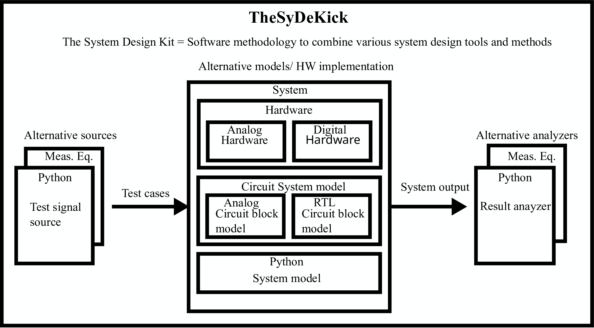
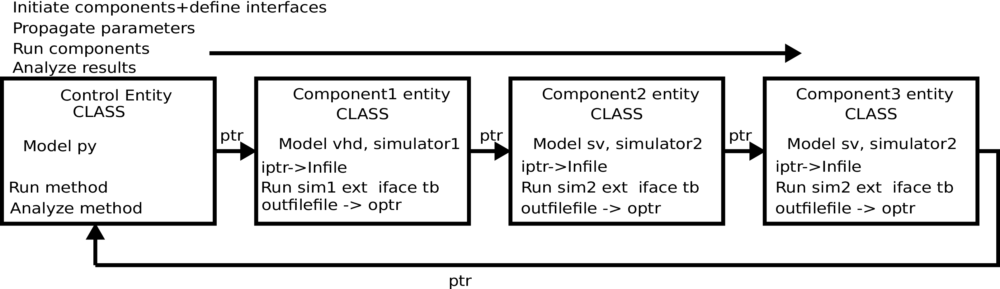

===========================
Introduction to TheSyDeKick
===========================

What is the TheSydeKick
=======================
TheSyDeKick is a development and testing framework for electronic systems. It
is primarily targeted for design and testing of integrated circuits and Systems
on Chip (SoC's). The operation principle of TheSDK is depicted below.

This is the master documentation of TheSystem development kit. These pages
provide an introduction and browsable documentation for the core Entities:
thesdk, rtl, spice and ads.

Operation principle
-------------------

TheSyDeKick supports the system design by "testing first" principle. Design is
started by writing a system test bench and simple model for the design under
test with Python. Gradually the implementation details are added to the DUT by
introducing analog circuit model or RTL level descriptions of digital
circuitry. Circuit level simulations are executed by calling external
simulators like Spectre, Eldo or Questasim. This makes it possible to write the
test cases and analyses for the system only once, and carry out the circuit
development with those tests from beginning to end.

It targets to using a single control environment to simulate, design and measure
the system components with various tools by using a single "Control
environment" for control, analysis, and visualization of the results.

TheSyDeKick also aims for full support of system measurements. The intended
operation is that once the circuit or system is manufactured, the signal
sources and analyzers of TheSDK model are replaced with measurement equipment,
and the same tests are carried out for the actual hardware within the same
framework. This requires a measurement hardware driver libraries that
are to be developed and released independently from TheSyDeKick core modules to 
follow the key principple of TheSyDekick: modularity.

Modular system description with objects
---------------------------------------
As TheSyDeKick targets hardware modeling, every instance can be thought as a
piece of equipment or hardware, as depicted below 

The entity object can contain almost anything, but it should follow two principles.

#. Inputs and outputs are pointers defined by TheSyDeKick IO class.  
#. Entity object, i.e. intance of thesdk class has a method that takes the
   value of an input pointer, manipulates it and assigns it to the value
   of the output pointer.

This make is possible to first implement the connections between the objects,
i.e. system components, and then pass the signals by calling the run methods of
the objects in controlled order. The call sequence control of the the
components ultimately form a scheduler, but currently this control is up to
user.

Reader is strongly encouraged to clone the repository and to run the
simulations as described in the README. That is a simple example case in were a
chain of inverters is simulated with python, verilog, vhdl, and Eldo, analog
circuit simulator. Even you would not have access to rtl simulator or eldo, the
python example is sufficient to demonstrate the operation principles of
TheSyDeKick.

System modeling and design exploration
--------------------------------------
It is evident that high level programming lanquages provide good tools for
system modeling. In addition, it is intended to develop interface classes for
Berkeley Analog Generator BAG and Chisel3 RTL generators to enable closed-loop
design optimization and desing exploration with real hardware.  

Further reading and related information
---------------------------------------
* A Roadshow slideset demostrating some use cases can be found at https://github.com/TheSystemDevelopmentKit/TheSyDeKick-roadshow/raw/master/pdffiles/TheSyDeKick-roadshow.pdf
* A tutorial for very basic use of TheSyDeKick is provided at: https://github.com/TheSystemDevelopmentKit/TheSyDeKick_tutorial . 
  See the slide set forr details: https://github.com/TheSystemDevelopmentKit/TheSyDeKick_tutorial/raw/master/pdffiles/TheSyDeKick_tutorial.pdf 
* Site https://github.com/TheSDK-blocks is a intended to distribute TheSDK-compatible, relatively general circuit models.

Project status and releases
---------------------------
Release schedule
................
Two annual release dates are currently planned: January 16, and June 14. Current release candidate branches for next release are named 'v1.9_RC'

**Roadmap for the next release is roughly**

* Support for Verilator
* Improved support for vhdl/verilog mixed language simulations, i.e refactoring of rtl and spice modules.
* Suport for CoCoTb
* Interface class for Chisel3 RTL generator
* Interface classes for Berkeley Analog Generator (currently works without)

For details, check the "Release" projects

**A bit longer term roadmap**

* Server based RTL simulation enabling single-sample push-pull and multi-tool feedback simulations.

Release history
...............
**Release v1.8 (3.8.2022)**

* Main progress: ( See: https://github.com/TheSystemDevelopmentKit/thesdk_template)
* Improved documentation: Core blocks documented with CI/CD at https://thesystemdevelopmentkit.github.io/docs/index.html
* ADS simulator interface module.
* Speedup for module addition to Python path
* Support for parametrized netlists
* Custom source locatoins for RTL simulations
* Bugfixes for VHDL simulations
* Several bugfixes for spice simulations

**Release v1.7 (20.1.2022)**

* Main progress: ( See: https://github.com/TheSystemDevelopmentKit/thesdk_template)
* Improved documentation in spice
* Unified IO file handling in all analog simulators
* Speed up of event-bsed IO file handling.
* Improved intermediate file cleanups.
* Possibility to save the state of an entity to a binary file and read it back.
* Colored log messages for improved clarity.
* File cache flushing speeds up rtl simulations.
* Custom rtl simulator dofile locations and possibility to control the content of the dofile from Entity.
* Improved parallel run execution.

**Release v1.6 (11.8.2021)**

* Main progress: ( See: https://github.com/TheSystemDevelopmentKit/thesdk_template)
* Support for NGSpice
* Support for AC simulations in spectre, eldo, and ngspice through modifications in IO file handling. Less tested with eldo.
* Model 'hw' for measurement equipment driver support.
* Currently supported models: Python, verilog, VHDL, eldo, spectre and ngspice netlists.
* Simulation speed up for RTL event type IOs through with sorted dicts.
* Development has been carried out for Python v3.6, runs also with python 3.9

**Release v1.5 (16.1.2021)**

* Main progress: This is mainly an bugfix and documentation improvement release. ( See: https://github.com/TheSystemDevelopmentKit/thesdk_template)
  initentity now initializes the minimum barebone buffer. Use of more complex template is optional.
* Python dependency installations now optionally upgrade already installed packages.
  * Currently supported models: Python, verilog, VHDL, eldo and spectre netlists.
  * Development has been carried out for Python v3.6

**Release v1.4 (14.6.2020->7.10.2020)**

* Main progress: Support for Mentor graphics eldo and Cadence spectre merged to common 'spice' module ( See: https://github.com/TheSystemDevelopmentKit/inverter or the thesdk_template)
* Currently supported models: Python, verilog, VHDL, eldo and spectre netlists.
* Development has been carried out for Python v3.6

**Release v1.3 (16.1.2020->24.1.2020)**

* Main progress: Verilog and VHDL modules merged to RTL module. VHDL entities are now simulated with Verilog testbenches.
* Support for Mentor Graphics Eldo analog simulator through eldo module. See: https://github.com/TheSystemDevelopmentKit/inverter
* Initiated documentation with docstrings. Html documentation provided for entities with ./configure && make doc, or by running make html in entities doc directory.

Configuration quickstart
========================
**OBS** 
THE SCRIPTS TO BE SOURCED ARE WRITTEN FOR T-SHELL

if you're using some other shell, change to tcsh or modify the scripts to be 
compliant with your shell.::

    tcsh

TheSyDeKick release 1.8 has been tested with Python v3.6

- Go to TheSDK directory and run:: 

    ./init_submodules.sh
    ./pip3userinstall.sh
    ./configure

- Edit the TheSDK.config file so that the commands for python invocations are
  correct. By default LSF submissions are enabled in TheSDK.config. If you do
  not have LSF,  please disable it from TheSDK.config The variables defines the
  commands used in Makefiles for simulation submission main thing to decide
  here is if you have LSF compliant cluster environment or not. Modify commands
  accordingly.

- The simplest possible simulation is defined in
  *Entities/myentity/myentity/__init__.py* To test your Python installation and
  configuration::

    cd Entities/myentity
    ./configure && make all

  You should see a input and output waveforms of a buffer model.

- Configure circuit simulators ( vsim, eldo, spectre etc.) tools to your path,
  modify sourceme.csh if needed and source it::

    source sourceme.csh

- To test your environment::

    cd Entities/inverter 
    ./configure && make clean && make all

  If you wish to test the Python functionality only, edit
  Entities/inverter/inverter/__init__.py and Change the line::

    models=[ 'py', 'sv', 'vhdl', 'eldo', 'spectre' ]

  to::

    models=[ 'py' ]

    and run ::

    ./configure && make clean && make all

How to use TheSyDeKick
======================

TheSyDeKick is a multi-tool simulation and developement environment for developing systems. 
It targets to using a single control environment to simulate,design and measure the 
system components with various tools by using a single "Control environment" for
control, analysis, and visualization of the results.

Implementation the "Control environment" is written in Object-oriented
Python. Python selected based on its good support for computing and signal processing, and support for
interfaces to measurement equipment.. 

Naming and structure
--------------------
The files are organized in directories as follows::

              TheSDK  
        pip3userinstall.sh  
        init_submodules.sh  
        configure  
        TheSDK.config (generated by configure)  
        Entities                               
            |                                  
            entity1                            
                entity1                         
                     |                          
                     __init__.py                
                     other_module.py            
                vhdl                             
                    |                           
                    entity1.vhd                 
                    tb_entity1.vhd                                     
                sv                                                
                    |                                   
                    entity1.sv                          
                    tb_entity1.sv
                spice
                    |
                    entity1.cir
                    tb_entity1.cir
                simulations
                    rtlsim
                        |
                        work

Naming convention is strict. The placeholder string 'entity1' above identifies the name of the Entity and it's netllists ans testbenches. User is not allowed to freely name the files. This is the basic configuration.

Guidelines to follow
--------------------

- All component descriptions, called Entities, regardless of the used
  tool/language are located under Entities directory.
- Git submodules are initiated with script `init_submodules.sh`. This is to
  give controlled  method to select what submodules to init.
- Things are configured with script named `configure`, that generates the Makefile.
- Things are executed with `make <recipe>`
- `configure && make` structure is used because by always following that we
  never need to document how to do configurations and executions. 

The main feature of TheSyDeKick is how to connect these objects (Entities) together. 
- IO's are pointers to a Data field of an IO class instance.
- Drivers write to that data field.
- Input read from that data field.

Following this guideline your entities retain compatibility with othe TheSyDeKick entities.
See `Entities/inv_sim/inv_sim/__init__.py` for reference.

- Entities are documented with docstrings. To read the entity documentation, do::

    cd Entities/rtl
    ./configure && make doc
    firefox ./doc/build/html/index.html

Documentation is NEVER comlete or good enough. Feel free to improve.

How to create and test new entity
---------------------------------

Create a new entity with::

    cd ./Entities
    ../thesdk_helpers/initentity <NAME>

Test the new entity::

    cd <NAME> && ./configure && make all

See  `../thesdk_helpers/initentity -h` for help
The new entity is created as a git project. Push it to your favourite repository

Class organization guideline
----------------------------

This is not a strict ruleset, rather a guideline how to alleviate your modeling tasks and support modularity.

The Entities and simulation setups are implemented as classes that
cross-reference to each other without restrictions. (Hardware) modules are
instantiated as object of that class.

- TheSyDeKick classes are intended to collect methods common to
  "TheSyDeKick"-framework.  They should NOT contain anything specific to a
  particular design. 
- Rtl class defines properties and methods that are required to run verilog and
  vhdl simulations.

- Spice class defines properties and methods that are required to run eldo and
  spectre simulations.

- If component has an  rtl model, it should  be a a subclass of rtl. If
  component does not have rtl as a superclass, rtl-requirements do not apply. 

- Design specific classes are freely defined by the designer

- A "system_paramemeter_class" may used as super class for the "system_tests"
  and "system_testbench" (not subcomponent entities) to define the properties
  that typically 

        1. Are common to whole system design. 

        2. Need not to be altered between simulations, but are most often
        propagated through property inheritance.

**EXAMPLE of design hierarchy**:: 
           
               system_tests     
                    |                
              system_testbench   
                    |              
                 "system"        
               /     \          
       "entity1"  "entity2"  
         |  
      "entity3"  

- Typically a simulation is controlled by "system_testbench" class that
  controls the simulation providing (or using) methods like  "run" and  "plot".
  This class usually contains a "design under test", which is a instance of
  "system" class, and methods requiered to run the simulations.  See:
  `Entities/inverter_testbench/inverter_testbench/__init__py`. 

- System is described in "system" class that determines the sub-components and
  the interconnections in between them, and methods to "run" the "system", i.e.
  how the signals propagate and in which order the methods of components are
  executed. Take  a look at `Entities/inverter/inverter/__init__.py` and
  `Entities/inverter_testbench/inverter_testbench/__init__.py`

As the test cases for inverter_testbench is extremely simple, the DUT is consturucted inside the testbench
is constructed inside it with 'parallel' and 'serial' methods. For more complex systems this is not preferred way.
This construction shoul happen in 'system' class that creates the top level descrption of the system.
       
- Class attributes are controlled and propagated by class constructor by
  copying the  selected properties from immediate "parent". The properties that
  are to be copied are determined  by "proplist" attribute. By doing this
  isntead of using inherited classes, we keep entities independent of  their
  use environment i.e. they can be used freely in other desings. Still we can
  automate the propagation  of the parameters.

- Component entities Entity1-Entity-3 are not subclasses to sim or system class
  as they should be independent of each other and transferrable between systems. 

- The "system_tests" and "system_testbench"  class should not be a parent class
  to system class, as the "system" definitions are independent of how it is
  simulated.

What next?
----------
Take yout time to get acquainted with `Entities/inverter`,
`Entities/inverter_testbench`, and `Entities/inverter_tests` together with the
documentation of *thesdk*, *rtl* and *spice* presented in this manual. Those
should  give you a picture how the things work. Create a new entity, and start
playing a round with it. See also: https://github.com/TheSystemDevelopmentKit/TheSyDeKick_tutorial

